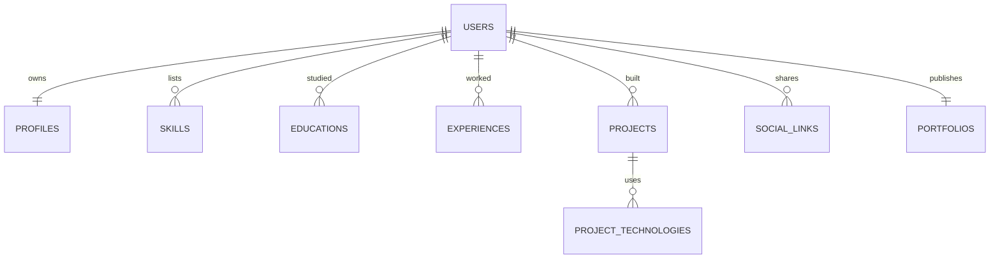
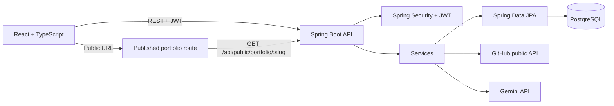

# Architecture

The application is a modular monolith. The browser talks to the Spring Boot API over JSON REST. The API owns authentication, validation, persistence, GitHub calls, and Gemini calls.

## Data model

## Backend request flow

`Controller → request/response DTO → service → repository → entity`

Controllers handle HTTP mapping and validation entry points. Services apply business rules and ownership checks. Repositories query by the authenticated user's email for private resources. Controllers return DTOs rather than JPA entities. `GlobalExceptionHandler` formats validation and application errors without exposing internal exception messages.

## Authentication and ownership

Registration hashes passwords with BCrypt. Login validates the hash and issues a signed HS256 JWT. `JwtAuthenticationFilter` validates each bearer token and installs the subject in Spring Security's context. Private endpoints require authentication. Update/delete lookups are scoped to the token subject, so knowing another resource's numeric ID does not grant access.

## Persistence

Users have one profile and one portfolio. Skills, education, experience, projects, and social links belong to a user. Project technologies use a JPA element collection table. Portfolio data stays separate from template choice. This initial MVP uses Hibernate schema update for local iteration; before production, move to Flyway/Liquibase migrations and `ddl-auto: validate`.

## Integrations

The GitHub service retrieves public repository metadata through GitHub's REST API. Import accepts a username/repository selection and fetches canonical repository data on the server before creating a project.

The Gemini service makes server-side `generateContent` requests with `GEMINI_API_KEY` in a request header. The browser only receives suggested text. Each AI task uses constraints against invented credentials, achievements, or metrics.

## Templates and publishing

The public portfolio response consists of the portfolio settings and portfolio data DTOs. The React public route selects a presentation from the stored template key. The public API only resolves a slug when `is_published` is true; editing APIs remain protected.
